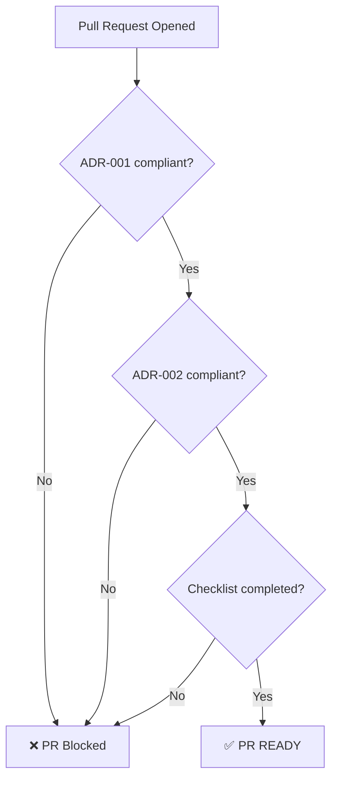

# MapTrack

MapTrack is a web application focused on **visual inspection, annotation and reporting**
using interactive maps, images and time-based records.

This repository follows **strict architectural and quality standards** enforced
automatically through CI.

---

## 🚦 Pull Request Status

A Pull Request is considered **READY** only when:

- ADR-001 passes
- ADR-002 passes
- PR checklist is fully completed

PRs failing these checks are automatically blocked.

---

## 🏗 Architecture

High-level architecture, data flow and boundaries are documented here:

📄 [`docs/architecture.md`](./docs/architecture.md)

---

## 📐 Code Conventions

Naming, folder structure, hooks rules and styling conventions:

📄 [`docs/conventions.md`](./docs/conventions.md)

---

## 🧼 Clean Code Philosophy

Mental models, reasoning and real-world examples:

📄 [`docs/clean-code.md`](./docs/clean-code.md)

> Rules are enforced by ADRs and CI.  
> This document explains **why**, not **what**.

---

## 🧠 Architecture Decision Records (ADR)

All architectural decisions are **versioned and immutable**.

### ADR Index

| ADR     | Version | Description                       |
| ------- | ------- | --------------------------------- |
| ADR-001 | v1.1    | Code Readability & Explicit Logic |
| ADR-002 | v1.0    | Hooks & Side Effects              |

📁 [`/ADR`](./ADR)

---

## 📊 ADR Compliance

Live compliance dashboard generated by CI:

📄 [`docs/adr-compliance.md`](./docs/adr-compliance.md)

---

## 🤖 Continuous Integration

CI validates every Pull Request:

- ADR compliance
- Checklist completion
- Code quality gates

No code is merged without passing all checks.

---

## ✅ PR Ready Flow

